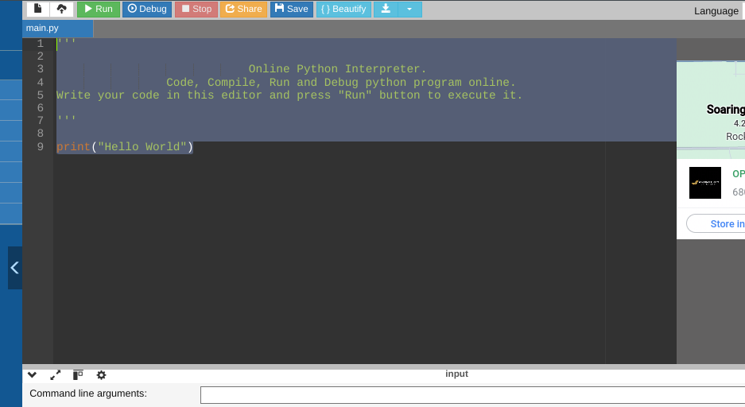
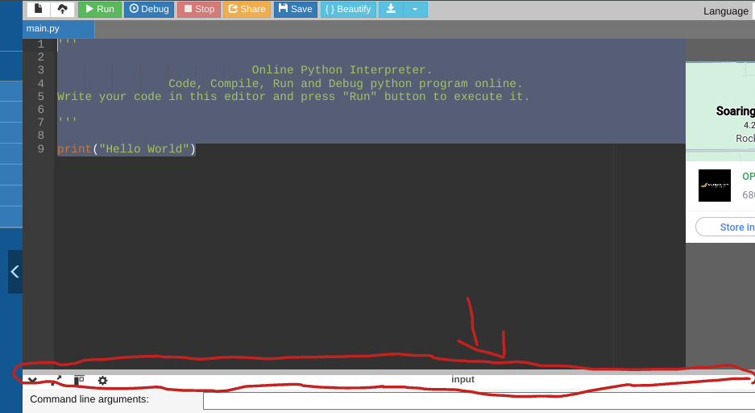
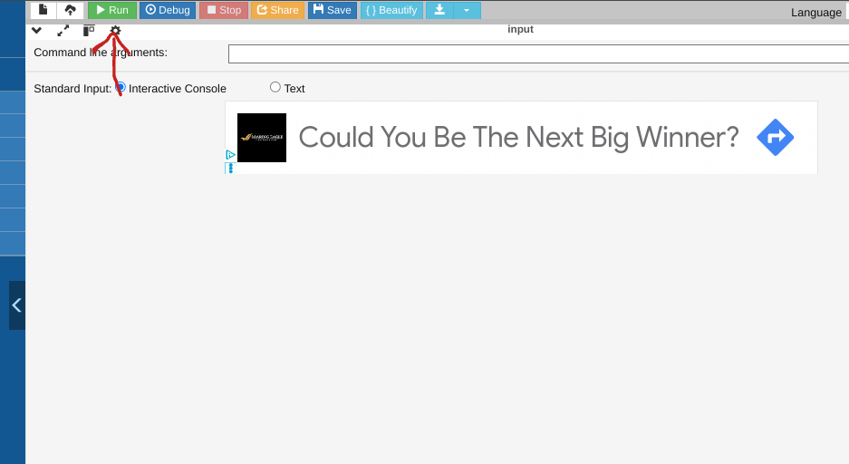

# WILLIM CYpher **UNFINISHED**
A little thing I made to cypher things 

Type HLP or HELP for a list of commands 

## Spacific Intructoins on how to run this on the shcool crome books (Victoria)

1. Open the main.py file and copy every thing in it
2. Go to [THIS LINK]()
3. Paste 'Ctr'+'v' the contents in this window

4. The click the gray bar at the bottom and pull up the console

5. Then press the green button that says run

